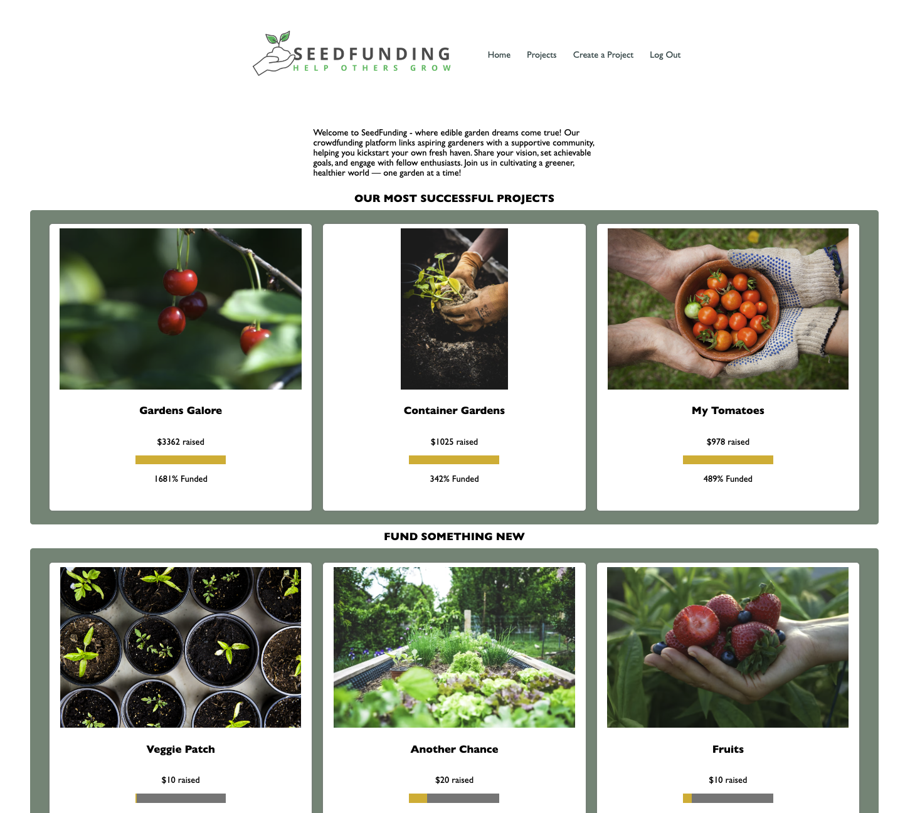
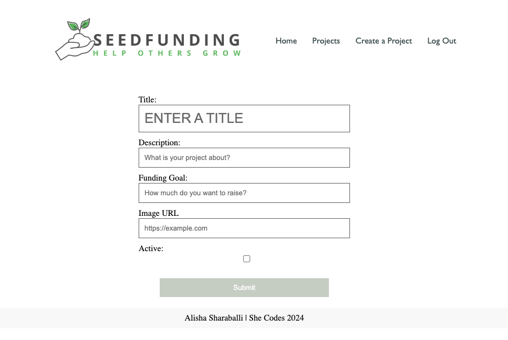
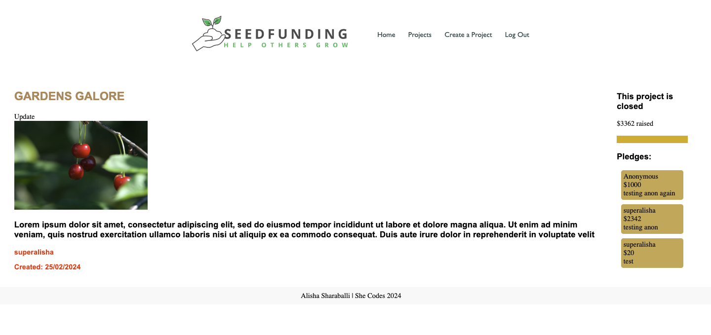
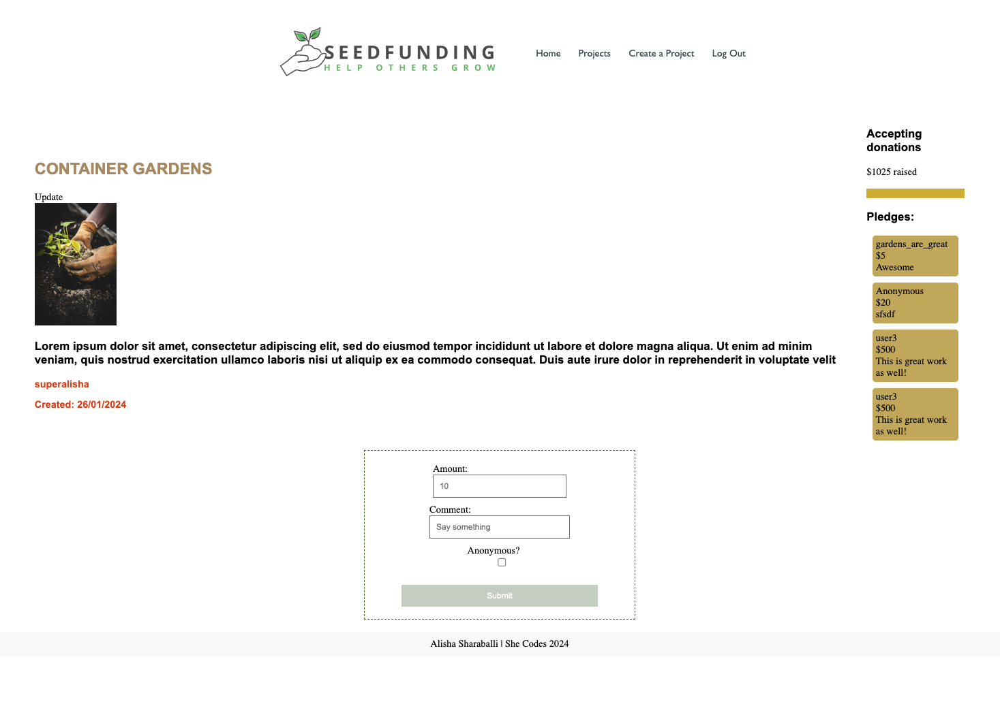

# CROWDFUNDING BACK END
View the deployed site at: https://crowdfunding-back-end18472.fly.dev/projects/

## Planning:
### SproutSeeds
Welcome to SeedFunding - where edible garden dreams come true! Our crowdfunding platform links aspiring gardeners with a supportive community, helping you kickstart your own fresh haven. Share your vision, set achievable goals, and engage with fellow enthusiasts. Join us in cultivating a greener, healthier world — one garden at a time!

###  Screenshots

# Your crowdfunding project must:
    [X] Be separated into two distinct projects: an API built using the Django RestFramework and a website built using React.
    
    [X] Have a cool name, bonus points if it includes a pun and/or missing vowels. See https://namelix.com/ for inspiration. (Bonus Points are meaningless)
    [X] Have a clear target audience.
    [X] Have user accounts. A user should have at least the following attributes:
        [X] Username
        [X] Email address
        [X] Password
    [X] Ability to create a “project” to be crowdfunded which will include at least thefollowing attributes:
        [X] Title
        [X] Owner (a user)
        [X] Description
        [X] Image
        [X] Target amount to fundraise
        [X] Whether it is currently open to accepting new supporters or not
        [X] When the project was created
    [X] Ability to “pledge” to a project. A pledge should include at least the followingattributes:
        [X] An amount
        [X] The project the pledge is for
        [X] The supporter/user (i.e. who created the pledge)
        [X] Whether the pledge is anonymous or not
        [X] A comment to go along with the pledge
    [] Implement suitable update/delete functionality, e.g. should a project owner beallowed to update a project description? - This functionality exists in the backend but has not been implemented in the front end yet. 
    [X] Implement suitable permissions, e.g. who is allowed to delete a pledge? - 
    [X] Return the relevant status codes for both successful and unsuccessful requeststo the API.
    [X] Handle failed requests gracefully (e.g. you should have a custom 404 pagerather than the default error page).
    [X] Use Token Authentication.
    [TBC] Implement responsive design.

